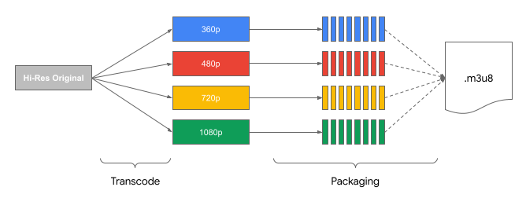
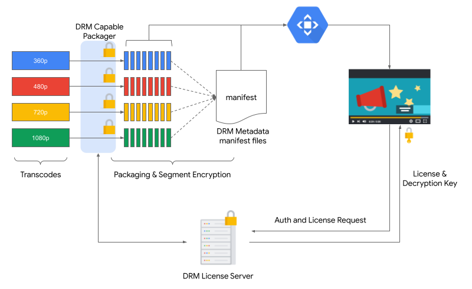

# Media Formats and Use Cases
{: .no_toc }

###### Table of contents
{: .no_toc .text-delta }

- TOC
{:toc}

Before we get into details of architectures and networks, it will be useful to take a brief look at
the various relevant media formats that underpin digital content delivery.

## Media Formats
Most video on the internet (especially for full length movies and other long-form content) is delivered via a
technology called “Adaptive Bit Rate” that can adjust for changing bandwidth conditions on the client viewer in real 
time. Apple’s _HLS_ (Http Live Streaming) and Google’s _DASH_ (Dynamic Adaptive Streaming over HTTP) are two dominant
formats and have a significant installed base, both on end consumer devices and also in terms of the tooling and
encoding/packaging software that media providers use to prepare their content.

Each of these formats generally follow the same operating principle:
1. The continuous video stream is broken up into smaller files called “segments”, which are of (generally) fixed
length, say 10 or 20 seconds (in the case of live events, the segments can be as short as 2-5 seconds).
2. Each segment is encoded into different resolutions (1080p, 720p, 360p, etc.) and therefore requires different
amounts of bandwidth to be shown to the user 
3. There is a manifest file that lists all the different versions (“renditions”) for any given time range. 
4. The video viewing app gets the manifest file and then based on the available bandwidth, downloads and shows the
most appropriate time segment; the player app also starts spooling the next time segment to stitch it into the
viewer seamlessly.

So, when a viewer is viewing a movie or live event on a digital platform (such as a mobile phone or smart TV),
they are essentially seeing small media files stitched together seamlessly on the player to present a continuous
video feed.

## Exploring Manifests
Manifest files are the list of time segments that constitute the video that the viewer will see.
Manifests are a deep and wide topic, and a full discussion of their nuances is out of the scope of this book.
However, this section will provide an overview of the major aspects.

Manifest files are UTF-8 encoded text (for HLS) and XML (for DASH) files that contain a variety of information about
the media asset, including, but not limited to:
* The urls of the media files for the various time segments (with start times and end times relative to the start of the asset
* The various bit rates available and the urls for the media files (time segments) corresponding to each
* Information and metadata regarding closed captioning
* Information and metadata regarding ad breaks

### HLS
An example of the HLS stream (delivered to the end client as an “m3u8” file) is given below:

This playlist manifest file (generally called `playlist.m3u8` or something similar) lists the media files that deliver
video and audio at different resolutions for a certain time segment.

```
#EXTM3U
#EXT-X-VERSION:3
#EXT-X-STREAM-INF:BANDWIDTH=800000,RESOLUTION=640x360
360p.m3u8
#EXT-X-STREAM-INF:BANDWIDTH=1400000,RESOLUTION=842x480
480p.m3u8
#EXT-X-STREAM-INF:BANDWIDTH=2800000,RESOLUTION=1280x720
720p.m3u8
#EXT-X-STREAM-INF:BANDWIDTH=5000000,RESOLUTION=1920x1080
1080p.m3u8
```

The playlist identifies the various manifests that provide different resolutions for the video;
a snippet of the 1080p manifest is as follows:

```
#EXTM3U
#EXT-X-VERSION:3
#EXT-X-TARGETDURATION:2
#EXT-X-MEDIA-SEQUENCE:0
#EXT-X-PLAYLIST-TYPE:VOD
#EXTINF:1.920000,
1080p_000.ts
#EXTINF:1.920000,
1080p_001.ts
#EXTINF:1.920000,
1080p_002.ts
```

In the above manifest, the sequence of segments is listed with a serial number suffixed
(e.g. ```1080p_000.ts``` and ```1080p_001.ts```)

### DASH
A simple example of a DASH manifest is given below:
```xml
<MPD xmlns:xsi="http://www.w3.org/2001/XMLSchema-instance"
     xmlns="urn:mpeg:dash:schema:mpd:2011"
     xmlns:xlink="http://www.w3.org/1999/xlink"
     xsi:schemaLocation="urn:mpeg:DASH:schema:MPD:2011 http://standards.iso.org/ittf/PubliclyAvailableStandards/MPEG-DASH_schema_files/DASH-MPD.xsd"
     profiles="urn:mpeg:dash:profile:isoff-live:2011"
     type="static"
     mediaPresentationDuration="PT1M54.3S"
     minBufferTime="PT9.6S">
    
    <ProgramInformation> </ProgramInformation>
    <Period id="0" start="PT0.0S">
        <AdaptationSet id="0" contentType="video" segmentAlignment="true" bitstreamSwitching="true">
            <Representation id="0" mimeType="video/mp4" codecs="avc1.4d4828" bandwidth="800000" width="1920" height="1080" frameRate="25/1">
                <SegmentList timescale="1000000" duration="4800000" startNumber="1">
                    <Initialization sourceURL="https://cdn.domain/content/mpd/1-sec/init-stream0.mp4"/>
                    <SegmentURL media="https://cdn.domain/content/mpd/chunk-stream0-00001.mp4"/>
                    <SegmentURL media="https://cdn.domain/content/mpd/chunk-stream0-00002.mp4"/>
                </SegmentList>
            </Representation>
            <Representation id="2" mimeType="video/mp4" codecs="avc1.42c00d" bandwidth="300000" width="320" height="170" frameRate="25/1">
                <SegmentList timescale="1000000" duration="4800000" startNumber="1">
                    <Initialization sourceURL="https://cdn.domain/content/mpd/init-stream2.mp4"/>
                    <SegmentURL media="https://cdn.domain/content/mpd/chunk-stream2-00001.mp4"/>
                    <SegmentURL media="https://cdn.domain/content/mpd/chunk-stream2-00002.mp4"/>
                </SegmentList>
            </Representation>
        </AdaptationSet>
    </Period>
</MPD>
```
As in the HLS case, the DASH manifest also lists the various segments sequentially, with a numerical suffix
(e.g. ```chunk-stream2-00001.mp4``` and ```chunk-stream2-00002.mp4```)

The above samples are essentially trivial examples of the two types of manifests. In reality, these manifests can be
fairly complex, and include other information such as closed captions, ad breaks, etc.

## Live Streaming
Live Streaming takes real-time content as it is being generated and distributes it to end users (e.g. newscasts,
sports events). The manifests for Live Streaming are continuously updated to include references to new segments
being created as part of the livestreaming feed.

Apple’s HLS [website](https://developer.apple.com/documentation/http_live_streaming/example_playlists_for_http_live_streaming/live_playlist_sliding_window_construction)
has a fantastic description of HLS manifests updated in a sliding window for a live stream.

## Video-on-Demand (VOD)
Video on Demand serves pre-recorded content on demand for the viewer, and ranges from short shared video
(e.g. those showing up in a social media feed) to full length movies (offered on subscription video platforms),
and all of this is delivered at varying levels of resolution to the end customer, depending on their bandwidth,
device profile, and application settings.

Manifests for VoD are generally static since all the segments constituting the stream are known in advance.
These manifests are very similar to what has already been shown in the “Exploring Manifests” section.

Apple’s HLS website also has a wonderful description of VoD playlist and manifest construction [here](https://developer.apple.com/documentation/http_live_streaming/example_playlists_for_http_live_streaming/video_on_demand_playlist_construction).

## Packaging and Dynamic Packaging
So far, we’ve seen the HLS and DASH manifests that refer to various small segments of the overall stream, where
each segment represents a small part of the video. The process of creating these segments from the larger original
asset and enumerating them into a playlist is called “Packaging”.

In the case of VoD, the flow can be shown as follows:


Overall, transcode is extremely CPU and resource intensive and packaging is very lightweight and fast. As you can see
above, pre-packaging content implies essentially doubling the overall storage required. Also, packaging requirements
are subject to change based on the destination where the media will be shown. Each distributor has their own packaging
requirements. Therefore, pre-computing the various anticipated packaging setups can be very storage intensive and most
of these assets may not get used. Also, for instance, in the case of a large episodic library, such as a long running soap opera, not all episodes will be equally popular. To pre-package and maintain all the content for all the episodes can be wasteful.

### Dynamic Packaging
“Dynamic Packaging” is the process of creating segments and manifests for only those assets that require it,
delivering them “just-in-time” (reusing any previously created packages if they conform to the desired output).
This “just in time” model is very efficient from an operational perspective and doesn’t create unnecessary replicas
of unused formats. This also allows delivery formats to change frequently without having to undertake costly and
time-consuming re-packaging of all transcoded assets.

## Manifest Manipulation
The process of dynamically modifying the manifest (such as, for example, to customize it for each viewer) is referred
to as “Manifest Manipulation” and is commonly found in scenarios where ads are inserted by the server. This allows
the server to insert ad media segments at predetermined spots in the manifest so the video client can seamlessly
make them part of the video feed.

The chapter called “Dynamic Ad Insertion” discusses this process in more detail.

## Digital Rights Management (DRM)
DRM distributes encrypted video segments that are decrypted by the video client after the decryption keys are provided
based on user authentication. This protects the content from being stolen by intermediaries who might try to capture
the segments and store them for later viewing.



In the above diagram, the encrypted segments are referenced by the manifest as normal, but the manifest additionally
contains DRM metadata (Widevine metadata for DASH and Fairplay metadata for HLS). The player contacts the specified
license server and provides the credentials that allow the license server to respond with the appropriate decryption
keys for the video player to correctly decrypt the segment and show it to the viewer.

