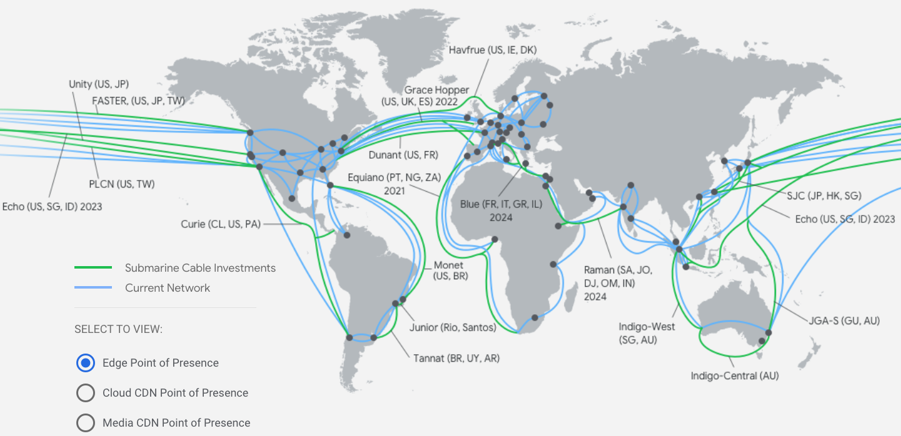
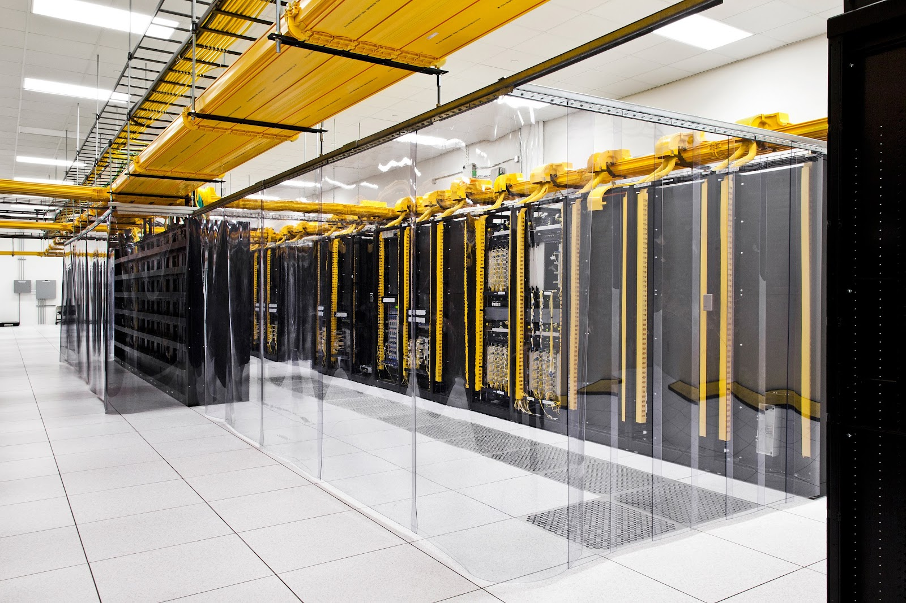
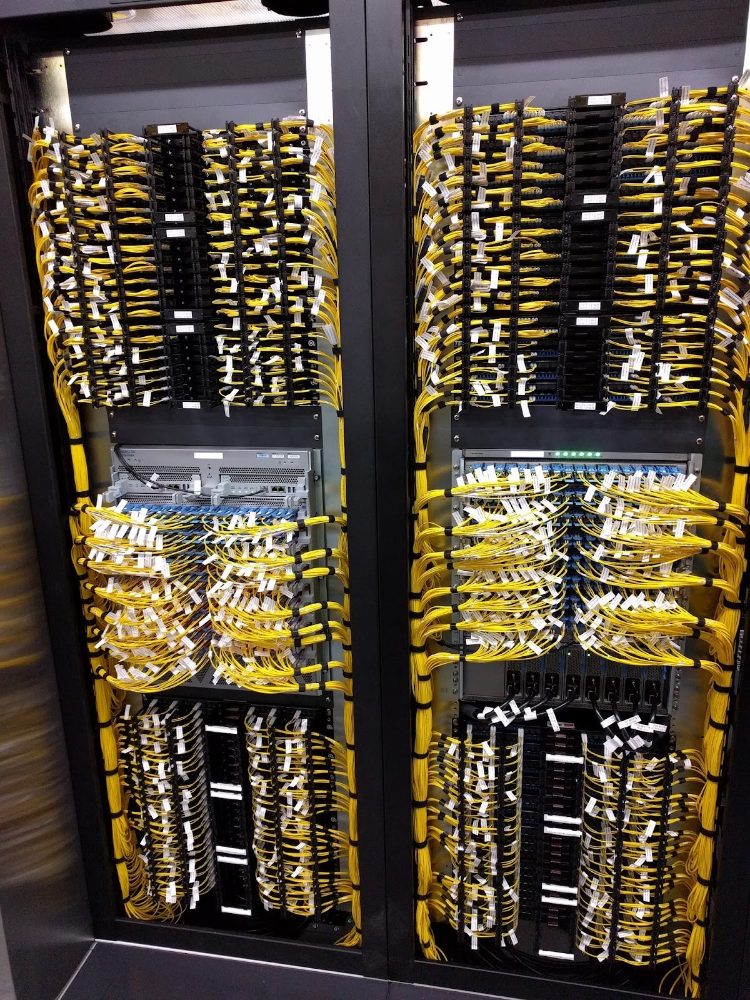
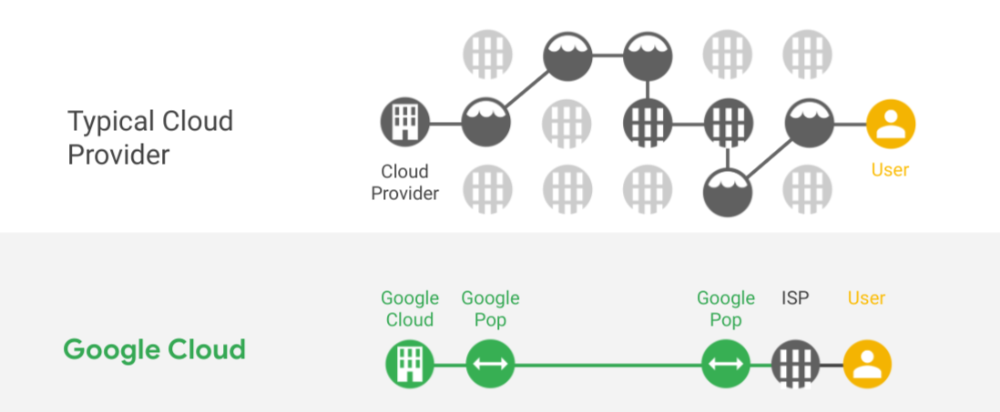
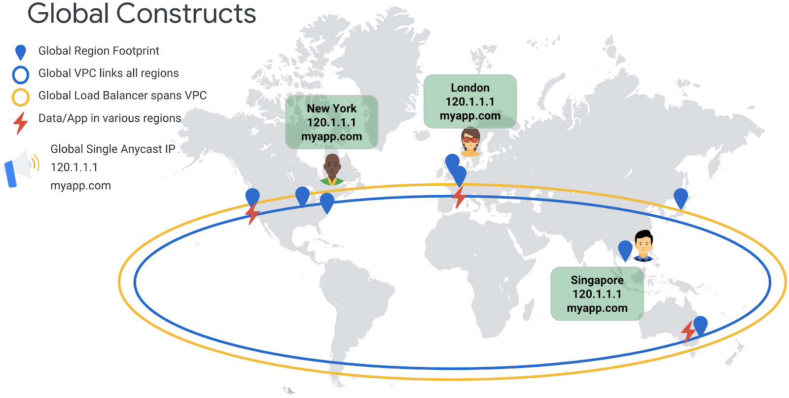

<!--
Copyright 2022 Google LLC

Licensed under the Apache License, Version 2.0 (the "License");
you may not use this file except in compliance with the License.
You may obtain a copy of the License at

    https://www.apache.org/licenses/LICENSE-2.0

Unless required by applicable law or agreed to in writing, software
distributed under the License is distributed on an "AS IS" BASIS,
WITHOUT WARRANTIES OR CONDITIONS OF ANY KIND, either express or implied.
See the License for the specific language governing permissions and
limitations under the License.
-->

# The Google Network
{: .no_toc }

###### Table of contents
{: .no_toc .text-delta }

- TOC
{:toc}

## Introduction
Google’s network is truly unique, and many of the innovations that Google has
brought to market have depended on this core network and its capabilities. No
discussion of media architecture can be complete without a thorough
understanding of the role that Google’s network can play in the design of an
industry-leading system that provides reach, reliability, performance, and security.

Let us first examine the structure of Google’s network, since that design has
important implications for the overall performance and features of any media
system. The network design of any company is based to a very large extent on
the needs and requirements of the core business that required its creation in
the first place; for Google, the requirement was to create a global search
engine that could ingest, process, and serve large amounts of data and content
from and to anyone, anywhere on the planet.

Google needed a global network from day-one.

Therefore, in Google’s case, its entire global data center footprint needed to
be connected into a single worldwide network from the start. Indeed, over time,
this is how Google has built out its network infrastructure: as a single, globe
spanning proprietary fiber network with multiple redundant paths connecting
various regions and data centers.

(Source: <a href="https://cloud.google.com/about/locations#network">GCP Network Locations</a>;
always refer to the given link for the latest information on Google's Network)

The above illustration shows Google’s owned and operated global fiber optic
network footprint. This network connects all of Google’s data centers,
points-of-presence, and caching sites.

This network structure allows traffic to flow from one regional data center to
another entirely on Google’s fast and proprietary fiber optic network. This type
of inter-region traversal removes any extraneous latencies due to inefficiencies
in stitching together a path with transit agreements and intermediate ISPs of
various levels of quality and performance.

The network shown above has been built over time and represents billions of
dollars of CAPEX in core infrastructure.

While the network is invisible to many, for Google, it is an intensely physical,
highly invested entity. Google lays thousands of miles of its own fiber, across
sea and land, to provide its users (both, enterprise and consumer) the best
possible experience.

When an enterprise chooses to deploy a workload, especially media,
on Google Cloud, it gets the  advantage of the cumulative investments and
expertise that Google has built up over the years.

INSERT IMAGES

### The Edge: Peering, Reach, and Innovation
The network shown above is not built to stand in isolation. Google extensively peers
with ISPs all over the world to provide high speed links into and out of its network.
This means that enterprises, and their end customers, can both benefit from these
Google-ISP relationships.

Google’s edge nodes represent the tier of Google's infrastructure closest to the
enterprises and end users. With Google's edge nodes, network operators and internet
service providers deploy Google-supplied servers inside their network. Google’s 
edge nodes allow host network operators to optimise their traffic exchange with
Google and enhance the quality of experience for end users.

Google’s primary network, [AS15169](https://www.peeringdb.com/net/433), maintains
over 200 public peering locations as well as over 120 private peering exchange points.

(Example of a PoP facility where Google has infrastructure. &copy; Google, Image cannot be used without permission)

 

(Example of a Peering Rack at a PoP facility where Google has infrastructure. &copy; Google, Image cannot be used without permission)

Google’s network maintains a 1 hop distance to almost every ISP 
on the internet, with multiple paths into each ISP that Google peers with.

Google has a dedicated team to forecast and manage peering capacity. It also employs
large scale automation and advanced algorithms to continuously solve the mapping
problem that most efficiently routes traffic requests from customers to individual
cache nodes and other backend systems on GCP.

Running this large fleet of nodes in over 130 countries and across thousands of ISPs
is hard: machines can require repair and maintenance at any given time.
Google has almost entirely automated the process of repairs, upgrades, and
installations. This means that on a weekly basis, there are dozens of new cache
rack turn-ups. Additionally, a vast majority of repairs are handled automatically
with no human intervention from Google: automated notification and ticketing systems
generate a work queue for the local support teams to execute.

Over a decade of edge innovation has been incorporated into Google’s edge technologies, such as:
* **Advanced protocol support** with automated upgrades to QUIC and HTTP/2 for clients supporting these protocols
* **Advanced congestion control** with TCP BBR that responds to actual congestion instead of proxies like packet loss
* **Global Anycast IPs** for greatly simplified DNS management
* **Volumetric DDoS mitigation** through anycast dispersion (that makes it hard to concentrate an attack on a single hardware node) and massive capacity to out-absorb the largest known DDoS attacks

When using the Google Cloud premium network (which is the default setting for all
new workloads), these features are provided out of the box with no extra
configuration required. Simply being on the Google network allows enterprises
to reach global audiences with confidence.

## Traffic Flow: Premium Network
Google’s network connects its data centers and points of presence (PoPs) on the
proprietary owned and operated fiber optic network backbone shown above.
This allows Google Cloud to offer what we call a “premium network” which attempts
to provide the fastest and most efficient path between two points using this network.

Comparison of typical network transit vs. Google Cloud Premium network transit. &copy; Google

Google’s network has been built to intelligently route traffic most efficiently
from the end customer to Google’s data centers and back out to the end user.
Therefore, traffic intended for a service running on Google Cloud ingresses into
Google’s network closest to the point of the requestor and then rides Google’s
proprietary network all the way to the destination. On the outbound, likewise,
the traffic traverses Google’s network for the longest possible distance before
egressing closest to the requestor’s location.

However, in the case of broadcast systems, the ingress and egress points for
traffic are different. This network allows a broadcaster to ingest content at the
source, such as an arena or a studio, and process it in the cloud, and transmit it
to partner networks and CDNs, all the while maximizing the transmission on Google’s
network, thus minimizing the network-related latencies.

## Global VPC
Users of Cloud are familiar with the networking concept of “Virtual Private Cloud”
or VPC. A VPC is a set of logically isolated resources within a larger public
cloud that a company can use to host their virtual infrastructure.

An example of the global VPC where a single, global Anycast IP address
is able to serve users world-wide. &copy; Google

In terms of Google Cloud, the above diagram shows how Google’s global network allows
the creation of a “Global VPC”.

In most clouds, VPCs are regional and subnets are zonal. In contrast, Google Cloud’s
VPCs are global, and the subnets are regional. While this is a simple sounding
distinction, the implications are profound.

Here is what a “regular” regional VPC with zonal subnets looks like:
<<todo: regionalized vpc diagram>>

Now, here’s what Google’s Global VPC looks like:
<<todo: global vpc diagram>>

With the GCP Global VPC, VMs in different regions can easily communicate with each
other without the need for extra overlays or explicit peering setups.

## GCP Global Load Balancer (GCLB)
Load balancers split incoming traffic amongst a pool of servers to prevent a
single server from having to respond to heavy incoming traffic. Most load
balancers are usually VMs with load balancing software installed or dedicated
hardware devices.

Many non-GCP clouds implement load balancers that are able to divide traffic in
a specific region. In many cases these cloud load balancers are implemented as
managed VM-based services provided by the cloud provider. These load balancers
are regional in design, because they’re underpinned by regional VPCs. The IP
addresses assigned to them are broadcast out of the specific region that the
load balancer is deployed in.

GCP’s GCLB design is entirely different. The GCLB is deployed as a managed
software defined service at the global network’s Points of Presence (PoPs).
This means that the GCLB is not a regional service, but a global service that
provides globally distributed load balancing at the network edge, close to the
end consumer. Therefore, when you create a GCLB instance, the routing rules,
SSL certificates, and other configuration parameters are propagated to the edge
nodes (shown in the images earlier) for edge-based SSL termination and routing.

GCP lets you create a single global Anycast IP address that is broadcast out of
all the PoPs, so a single IP address can be used to globally route your
customers to the nearest Google PoP. Additionally, the GCLB is intrinsically
geo-aware. The GCLB deployed at the PoPs maps the inbound request to the various
URL mapping and forwarding rules, and routes the request to the geographically
closest healthy backend without any extra effort or configuration required on
part of the application operator. Workloads can be placed in different GCP
regions (with new locations being added at different times) and the GCLB will
adjust traffic accordingly for optimal performance.

For data stored in GCP or for services running in GCP, extensive DNS
“distributions” are not required. Since the network is already unified at the
back end, a lot of detailed instructions about how to route and transmit data
are not necessary. This greatly simplifies the process of adding CDN capability
to existing data stored in GCP buckets, or existing application services
(like REST APIs or Websites) running behind the GCP GLB.

Media has a global audience. Using the GCLB makes it easy to deploy services to
serve content and data globally.

## SSL & Custom Domains
The GCLB offers SSL support out of the box at no extra charge or performance
degradation. This allows you to easily serve your content and media from your
own branded domain. When you attach a certificate to the GCLB, the certificate
is distributed globally to every GCP PoP  to allow SSL termination at the edge.
Likewise, when creating forwarding rules and URL mappings, these configurations
are also propagated globally to all PoPs that are fronting the GLB.

In some cases, this can take a few extra minutes to complete (i.e. you’ll not
see the changes occur right away), but the benefit is that your configurations
and certificates are being brought closer to the end user of your service for a
low latency and high performance user experience.

Recently, Google Cloud has also enabled procuring domain names from directly
within the cloud console. This allows the media enterprise a single control
plane for the entirety of serving content through the cloud: procure the domain
name (that automatically maps the name servers to GCP), provision the IPs, map
the subdomains, create and attach the managed SSL, and serve content via a
global load balancing infrastructure that activates the CDN with a single click.

## Dedicated Interconnect
Dedicated Interconnect provides direct physical connections between a company’s
on-premises network and Google's network. Dedicated Interconnect enables the
transfer of large amounts of data between networks, which can be more
cost-effective than purchasing additional bandwidth over the public internet.

Google Cloud’s Dedicated Interconnect is available in a 99.99% availability
configuration and can be configured in multiples of 10G or 100G links.

Combined with the fully software defined global VPCs, Dedicated Interconnect
can help modernize on-prem head-ends with in-cloud processing and scaling.

Additionally, Dedicated Interconnect can be used to transfer archival media and
multiple live-stream channels to the cloud to process and distribute.

