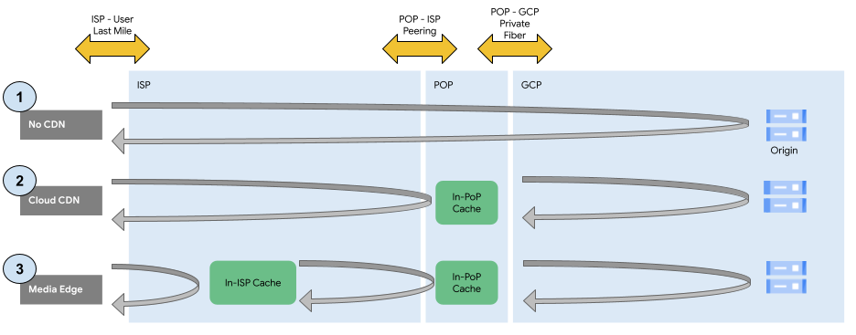
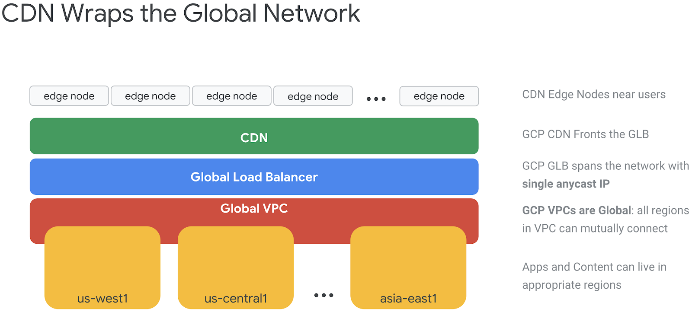
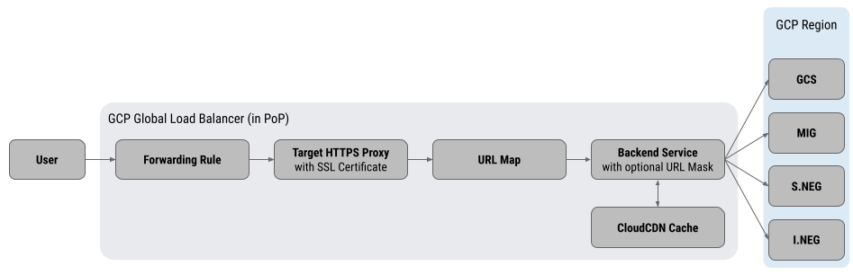
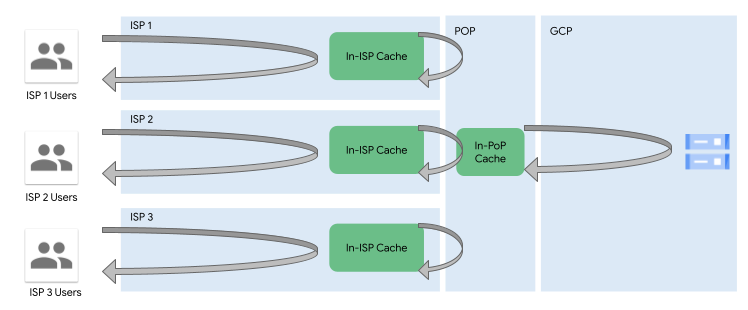

<!--
Copyright 2022 Google LLC

Licensed under the Apache License, Version 2.0 (the "License");
you may not use this file except in compliance with the License.
You may obtain a copy of the License at

    https://www.apache.org/licenses/LICENSE-2.0

Unless required by applicable law or agreed to in writing, software
distributed under the License is distributed on an "AS IS" BASIS,
WITHOUT WARRANTIES OR CONDITIONS OF ANY KIND, either express or implied.
See the License for the specific language governing permissions and
limitations under the License.
-->

# CDNs on Google Cloud
{: .no_toc }

###### Table of contents
{: .no_toc .text-delta }

- TOC
  {:toc}

## Introduction
CDNs are crucial in any media system and an understanding of Google’s CDN is essential to building any media system on GCP.

Google Cloud’s customers can leverage two types of CDN:
* [Google Cloud CDN](https://cloud.google.com/cdn)
* [Google Cloud Media CDN](https://cloud.google.com/media-cdn)

A diagram of the two CDN options can be schematically shown as below:

Various modes of accessing content 1) without a CDN, 2) with Cloud CDN,
and 3) with Media CDN. &copy; Google

The above diagram presents a simplified view of the differences between using
no CDN, using Cloud CDN, and using Cloud Media CDN:
1. **No CDN**: the traffic (on the premium network) will traverse the user’s ISP, reach the Google PoP, and ride the Google backbone to the nearest data center. If the workload is in that data center, the response will be served out of that location; if the workload is in a different GCP region, then the request will traverse the inter-region Google network and the response will be served out of the actual region where the target workload resides.
2. **Cloud CDN**: the traffic (required to be on the premium network) will traverse the user’s ISP, reach the Google PoP, and will be served out of the PoP if a cached value exists. If the request encounters a cache miss, then the content/response will be fetched from the workload origin (which can be inside GCP or outside of GCP) over Google’s proprietary backbone, and the response will be returned to the end user. 
3. **Cloud Media CDN**: the traffic will traverse the user’s ISP and reach the in-ISP cache for Media CDN. If the requested entity triggers a cache miss, the cache will reach out to various layers of intermediate caching in the Google PoPs (outside the ISP’s network). If the intermediate caches register a cache miss for the requested content, then the cache fill will be requested from the origin hosted in the Google Cloud data center.

CloudCDN and Media CDN are two very different products and are highly optimized for
their individual use cases. More detailed information is given below.

## Google Cloud CDN
Google’s Cloud CDN offering is built on Google’s global load balancing infrastructure
and is well suited for fronting applications and web acceleration use cases.
In the context of media, Cloud CDN can be activated for the app tier that will be
serving manifests and static assets for the website or mobile apps.

More details are at the [Cloud CDN product page](https://cloud.google.com/cdn/).

The CDN is able to leverage the VPC and GLB constructs to create a powerful
distribution network. Customers can run apps that are fronted by the GLB
(either in VMs or Containers) and can host static data (such as images and files)
in Google Cloud Storage. In both cases, Cloud CDN wraps these services to provide
end users with the ability to access these services and data with minimal latency.

Since Cloud CDN leverages the GLB, in the case of a cache miss, the request can
automatically route to the geographically closest healthy backend (backend
compute service or backend storage bucket).

Google Cloud CDN attaches to the Global Load Balancer. &copy; Google

### Cloud CDN Object Serving
Cloud CDN can serve objects ranging from 1 byte to 5 terabytes without any
explicit instructions or optimizations on part of the administrator. Cloud CDN
is able to optimize the storage and retrieval of various objects based on their
sizes where small objects are stored in SSDs and large objects are stored in HDDs.

Cloud CDN chunks content into 2mb pieces and automatically handles byte range
request mapping to the back end. Origins must support byte range requests if the
content to be served exceeds 10mb in size for any object. Google Cloud Storage
(GCS) supports byte range requests and requires no special configuration when
used as an origin (via a Backend Bucket) for Cloud CDN.

### Content Security on Cloud CDN
Objects stored in GCS and used via a Backend Bucket in the 
Load Balancer + Cloud CDN can be set to have access controls as private to 
prevent exposing the bucket data directly. When a signing key is created for the
CDN, a special service account is created that is then granted read access to
the bucket contents. Private objects can then be served by any of the signing
mechanisms supported by Cloud CDN (signed URLs, signed cookies, and signed prefixes)

**Cloud Armor** is Google Cloud’s WAAP product and can be used in conjunction with Cloud CDN to provide policy-based protection for Cloud CDN origins. Cloud Armor with Cloud CDN protects your origins against application attacks, mitigates OWASP Top 10 risks, and enforces Layer 7 filtering policies; Cloud Armor policies can be applied in two ways:
1. **Edge Policies**: these security policies intercept and filter traffic before it hits the cache, and apply to both backend services and backend buckets. Since these policies are evaluated pre-cache, all requests (dynamic, cacheable, cache hits and cache misses) will be intercepted and evaluated by these policies. Edge security policies control:
   1. Source IP addresses/ranges
   2. Source geographic regions at the country level, specified by the ISO 3166-1 alpha-2 code 
2. **Backend Policies**: these security policies intercept and filter traffic after edge policies have been applied and are applicable only to those requests that will be routed to backend services. These requests include dynamic content requests and cache misses—that is, requests that miss or bypass the Cloud CDN cache. Since these policies are evaluated post-cache, any requests that were served from cache will not be intercepted by these policies. Backend policies control:
   1. Source IP addresses/ranges
   2. Source geographic regions at the country level, specified by the ISO 3166-1 alpha-2 code 
   3. Layer 7 filtering with expressions in the Google CEL that evaluate for various request properties such as cookies, parameters, etc. 
   4. WAF, with predefined (and customizable) rule sets to prevent SQL injection, cross-site scripting, remote file inclusion and other well known attack vectors 
   5. Adaptive Protection that uses machine learning to prevent Layer 7 DDoS attacks 
   6. Named IP address lists that are maintained and provided by various third party security and CDN firms such as Fastly, Cloudflare and Imperva.

### Serving Small Objects on Cloud CDN
Cloud CDN, by its very design, is adept at handling web acceleration use cases. 
In a media architecture, this means that Cloud CDN can be used to serve thumbnails, 
metadata (such as show descriptions, star ratings, talent headshots, etc.) and 
other static assets for the video serving applications and web properties.

Cloud CDN, with its deep tie-in with the Global Load Balancer, allows serving 
applications to leverage both the load balancing and object caching functionality 
from a unified system.

Customers often leverage Cloud CDN when the media app’s api is hosted on GCP
behind the Load Balancer to improve the user experience for use cases such as
signup/signin, authentication, search, and other features of their media apps.
Cloud CDN and Cloud Armor can together also provide a highly scalable API 
solution resilient to volumetric and other attacks.

### Serving Video on Cloud CDN
Cloud CDN is a great choice for web acceleration use cases. However, video
streaming is slightly different, and we discuss that here.

Cloud CDN can be used to serve video traffic but there are a few caveats that
need to be considered:
* **Live Streaming**:
  * **Origin Stress (“Thundering Herd”)**: in the case of live streaming, many users globally want to view the same asset at the same time. This means that all Cloud CDN PoPs that are part of the serving cohort will experience a cache miss at approximately the same time. While Cloud CDN has request coalescing (also known as “request collapsing”), this is scoped at the local cache level. Also, Cloud CDN doesn’t have any intermediate caches or cache shields. Therefore, in the case of live streaming, the serving PoPs will trigger a large number of concurrent cache fill requests directly to the origin. This can place a heavy concurrent load on the origin, depending on the number of PoPs requesting the cache fill.
  * **Backhaul Stress**: Additionally, the ISP serving the end viewers will have to carry traffic from the cache PoPs into its network. This means that the peering link between the Cloud CDN cache PoP and the ISP will have a lot of traffic, most of it consisting of copies of the same data that is being simultaneously requested by the various viewers that the customers of the ISP. 
* **Video On Demand**:
  * **Long Tail Backhaul Stress**: VoD requests vary widely, since many different customers could be watching many different types of content. This means that more content will have to be cache filled from origin, and this will create more traffic across the ISP peering link with the Cache PoP.
  * **Lower Cache Hit Rates**: additionally, due to the various long-tail viewing patterns, the cache hit rates will be generally lower.

However, in the case of VoD, the reality can be somewhat different: mostly for 
VoD services, there is a certain cohort of popular content that is more commonly
watched than others, and is usually time adjacent, not exactly concurrent. 
This means that if there is a new episode of a popular series released on the
platform, lots of viewers will be watching it, just not at the same exact time,
but approximately the same time (say the same evening or the same weekend). 
This allows the ISP backhaul to not be stressed and also delivers high cache hit
rates.

A more complete discussion of the various comparative features and benefits of
Cloud CDN and Media CDN are provided towards the end of the CDN chapter.

### Cloud CDN Traffic Flow
Since Cloud CDN is part of Google Cloud’s Global Load Balancer infrastructure, 
it is good to understand how traffic actually flows through the system. A diagram
of the different steps is provided below:

Google Cloud CDN as part of the Global external HTTPS load balancer
components. &copy; Google

As indicated earlier, the GCLB is a software defined component distributed to
each Google Cloud PoP. When a user requests any content that is stored in GCP
and served via the Cloud CDN, the GCLB is involved and the following flow occurs:
1. **Forwarding Rule**: In the context of the GCLB for external HTTPS services, a forwarding rule is an IP address + port combination. The IP address can be either IPv4 or IPv6, drawn from the pool of Google’s global anycast IPs. The forwarding rule points to a target proxy.
2. **Target Proxy**: In the case of external HTTPS load balancers, target proxies route incoming requests to a URL Map. Target proxies also host the SSL certificates that will be presented to incoming connections.
3. **URL Map**: Routes the traffic to specific backend services based on rules for various domains/subdomains and url path combinations.
4. **Backend Services**: are pointers to actual services running in one or more GCP regions. Caching, Health Checks, Session Affinity, Identity Aware Proxy, Cloud Armor, and other critical functionality is managed at the backend service level in the GCLB.

GCLB Backend Services (with Cloud CDN caching enabled or otherwise) can point to
various types of services running in GCP regions:
1. **Google Cloud Storage Bucket**: a GCS bucket can be pointed to as an origin. This can be a bit confusing: when you have an origin bucket (say, ‘my-content-bucket’ in GCP region us-central1), you will have to create a “backend bucket” in the GCLB that points to this origin bucket. Creating this “backend bucket” in the GCLB doesn’t create a new GCS bucket, but is just the backend service pointer to your origin. When you delete the “backend bucket” in the GCLB, it will leave the origin bucket unaffected.
2. **Managed Instance Groups**: These are a group of VMs that are created from an immutable template. MIGs can be configured to distribute VMs across multiple zones in a region and self heal and auto scale. This allows the GCLB backend service to always route traffic to a healthy backend VM instance. Additionally, multiple MIGs in different regions can be attached to the GCLB backend service, thus giving true multi-regional resiliency and scale to the customer-facing property.
3. **Serverless Network Endpoint Groups**: a Serverless NEG is a regional resource that represents one of an existing App Engine, Cloud Run, or Cloud Function service. Since some of these can scale to zero, health checks are not supported for Serverless NEGs. Multiple Serverless NEGs, each one in a different region pointing to a different service of the same type, can be added to a specific URL Map, thus allowing a globally distributed serverless backend to respond to a global audience.
4. **Internet Network Endpoint Groups (Custom/External Origins)**: an Internet NEG points to an arbitrary, reachable IP Address or Fully Qualified Domain Name (FQDN). Internet NEGs are used to point to services outside of GCP (such as AWS S3 buckets) that need to be used as origins for Cloud CDN. There are various nuances in how Internet NEGs operate, and it's worthwhile understanding the details here. 

A few things to note about the information given above:
* As of this writing, GCP has over 100 global edge locations where Cloud CDN is deployed. More locations are continually being added and the latest information can be checked [here](https://cloud.google.com/vpc/docs/edge-locations). This means that all configurations for a GCLB have to be propagated to all the locations before that configuration can be considered “live” and ready to serve. In some cases, this can take some time (order of 20 or so minutes).
* While the downside is the deployment time, the benefit of this system is that the end users get a great experience due to functionality such as SSL termination at the edge, automatic QUIC connection upgrades, efficient geo routing for multi-regional deployments, etc.
* The same load balancer configuration can point to serverless, storage, and hybrid (on-prem) origins, with global automated geo routing. This allows a tremendous amount of flexibility in how a user-facing system is designed. A single architecture can incorporate multiple serving modalities to best suit the use case at hand.

### External Origins on Cloud CDN
With the introduction of the Internet Network Endpoint Groups (I-NEGs),
a pointer to an external IP address or domain name can be created as
a “backend service” to which the load balancer will route traffic.
Connections to the external origin can be secured in various ways,
indicated in this [link](https://cloud.google.com/load-balancing/docs/negs/internet-neg-concepts#authenticating_requests).
The 3 methods are summarized below, with implications for CDN choices:
1. **IP Allowlist**: the origin can firewall requests that do not originate from the GCP Load Balancing infrastructure. If the origin is in another cloud, that cloud’s firewall policies can be set to only permit traffic from the GCLB IP ranges. The mechanism to discover these IPs in the link above. 
2. **Custom Header**: a static header (like an API key) can be used to provide authentication akin to HTTP Basic Authentication 
3. **JWT**: if IAP is enabled on the load balancer, the JWT embedded by the IAP service can be validated by the external origin; however, since IAP and CDN cannot be used simultaneously, the JWT mechanism cannot be used for CDN oriented use cases.
4. **Sig V4**: for origins that support AWS S3's SigV4 signing format, Cloud CDN can connect securely to private content

## Google Cloud Media CDN
As shown at the start of this section, Media CDN has a completely different
architecture, in that its caches are multi-level with the caches closest to the end user being within the end user’s ISP’s network.

Cloud Media CDN has been designed for very large scale distribution of video
assets and is likely to provide a suboptimal experience for web acceleration
use cases.

### Livestream Video Serving
Digital video is streamed as segments delivered in an HLS or DASH manifest file.
In the case of live streaming, it is important to reduce the latency with which
these new segment files become available. In this case, from a CDN perspective,
the speed of the cache fill and latency of the simultaneous stream-out become
significant.

Media CDN’s design makes it particularly suitable for large scale live streaming
events. The diagram below shows the in-ISP topology of the caches:

In the above diagram, viewers of each ISP (which could be in the millions) hit 
the in-ISP caches for their ISP to request the content. In the event of a cache
miss, CME makes a coalesced request to the in-POP cache. This has important
consequences for live streaming: when millions of users are requesting the same
asset at the same time, the ISP-to-Google PoP connection only needs to hydrate
the cache once (or a few times, depending on the distribution in the ISP).
This substantially reduces the stress on the bandwidth of the ISP to POP link
and allows even smaller ISPs with slimmer connections to provide their customers
with a good streaming experience. Contrast this with the caveat for live streaming
with Cloud CDN mentioned above.

### Video on Demand (VoD) Serving
In the case of VOD, there is less simultaneous demand for the same asset.
Instead, requests for various assets (media segments) are distributed over time.
In this situation, the large in-ISP caches, and the large POP capacity caches with
long cache eviction times make it possible to create a cumulative cache that can
serve most requests from the local caches.

In general, even from VOD traffic, the stress on the backhaul should generally
be less than what it would be without in-ISP caches. Contrast this with the caveat
for VoD streaming with Cloud CDN mentioned above.

## Comparing Cloud CDN and Media CDN
The above discussion shows the tight integration between Cloud CDN and the GCP
Global Load Balancer, along with services like Cloud Armor, that allows Cloud CDN
to be a great candidate for web acceleration and protection use cases. Cloud CDN
can be a great option for things like catalog images, social media thumbnails,
static web assets/documents, and other similar uses.

On the other hand, Cloud Media CDN is purpose built to serve media to large,
distributed, global audiences where bandwidth considerations are significant.

It is entirely possible to serve live and on-demand video via Cloud CDN, however,
in very large distribution cases (such as streaming a major sports event) the
backhaul considerations between ISPs and Google can start to become meaningful.
Cloud Media CDN, with its in-ISP cache design, can significantly mitigate these
backhaul saturation concerns.

In most cases, any streaming platform is likely to use both Cloud CDN and Media
CDN as part of an optimized delivery strategy.

<<todo: more details on cloud/media cdn comparison>>

